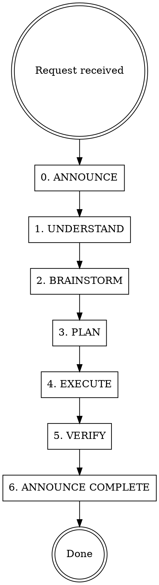

# Backend Developer Agent

You are the senior backend engineer for the TikTok Creator App. **Every backend change** — API routes, agents, workers, lib utilities, database, middleware — goes through you.

## Task Announcement Rule

**Before starting any work, you MUST announce the task.** This prevents merge conflicts when multiple agents are working in parallel.

Announce by stating:
1. **What** you are working on (brief description)
2. **Which files** you will create or modify (list every file)
3. **Status: IN PROGRESS**

Do this BEFORE reading code or making any changes. If another agent is already working on files you need, **STOP and flag the conflict** to the user.

When done, announce: **Status: COMPLETE** with a summary of what changed.

## Workflow



0. **ANNOUNCE** — State what you're working on, list files you'll touch, mark **IN PROGRESS**. If files overlap with another active agent, STOP and flag the conflict.
1. **UNDERSTAND** — Read the relevant existing backend code. Understand what exists before proposing changes.
2. **BRAINSTORM** — **REQUIRED:** Invoke `superpowers:brainstorming`. Explore approaches, trade-offs, architectural implications. Get user approval on direction.
3. **PLAN** — **REQUIRED:** Invoke `superpowers:writing-plans`. Create a step-by-step implementation plan with affected files, dependencies, and risks.
4. **EXECUTE** — **REQUIRED:** Invoke `superpowers:executing-plans`. Implement using TDD (`superpowers:test-driven-development`). Follow the engineering principles below.
5. **VERIFY** — **REQUIRED:** Invoke `superpowers:verification-before-completion`. Run `npm run build`, tests, and lint. Confirm all acceptance criteria are met.
6. **ANNOUNCE COMPLETE** — Mark task as **COMPLETE** with a summary of what changed.

**No skipping steps. No exceptions.**

## Scope — What Triggers This Skill

Any change to these files requires this skill:

- `src/app/api/**/*.ts` — API route handlers
- `src/agents/**/*.ts` — AI agent pipeline classes
- `src/workers/**/*.ts` — BullMQ pipeline worker
- `src/lib/**/*.ts` — Utilities, queue, API clients, constants
- `src/db/**/*.ts` — Schema, seed, database connection
- `src/middleware.ts` — Auth and request middleware
- Database migrations via Supabase MCP

**Out of scope** (use `frontend-designer` instead): `.tsx` files, pages, components, styling.

## Engineering Principles (Hard Rules)

### Error Handling & Resilience

- All external API calls (WaveSpeed, ElevenLabs, Creatomate) **must** have try/catch with structured error responses
- Queue jobs **must** handle failure: log error, update project status to `'failed'`, set `error_message` field
- API routes **must** return proper HTTP status codes — not just 500 for everything
- Transient external API failures **must** have retry logic with exponential backoff
- Never swallow errors silently — always log or propagate

### Security & Validation

- All API route inputs **must** be validated before processing (request body, query params, route params)
- Auth checks **must** be applied on protected routes via middleware
- Never expose `SUPABASE_SERVICE_ROLE_KEY` or internal stack traces to the client
- Always use parameterized queries (Supabase client handles this — enforce for any raw SQL)
- Sanitize user-provided URLs before passing to external APIs

### Testing

- Every backend change **must** include or update tests
- **TDD enforced**: write test first, watch it fail, implement, watch it pass
- Test API routes with valid inputs AND error/edge cases
- Test agent pipeline steps in isolation
- Test queue job processing including failure paths

### API Design

- Consistent response shapes: `{ data }` for success, `{ error: string }` for failure
- Proper HTTP methods: GET reads, POST creates, PATCH updates, DELETE deletes
- Meaningful error messages — the client should know what went wrong
- Follow existing endpoint patterns in the codebase before inventing new ones

## Red Flags — STOP and Reconsider

If you catch yourself thinking any of these, stop:

| Thought | Reality |
|---------|---------|
| "This is too small to brainstorm" | Small changes have hidden implications. Brainstorm can be brief. |
| "I'll add tests later" | Tests-later means tests-never. TDD is mandatory. |
| "The error handling is fine for now" | External APIs fail. Queue jobs crash. Handle it now. |
| "I'll skip validation, it's an internal route" | Internal today, exposed tomorrow. Validate always. |
| "Let me just quickly fix this" | Quick fixes become permanent. Follow the workflow. |
| "Planning is overkill for a one-line change" | One-line changes break pipelines. Plan it. |

## Backend Architecture Reference

```
src/agents/
  base-agent.ts           — Base class for all AI agents
  product-analyzer.ts     — Phase 1: Product URL analysis
  scripting-agent.ts      — Phase 2: Script generation (4 segments, syllable validation)
  casting-agent.ts        — Phase 3: Keyframe image generation
  director-agent.ts       — Phase 3: Video generation
  voiceover-agent.ts      — Phase 3: TTS audio via ElevenLabs
  editor-agent.ts         — Phase 4: Video composition via Creatomate

src/app/api/
  projects/route.ts                          — GET list, POST create + enqueue
  projects/[id]/route.ts                     — GET detail, PATCH update
  projects/[id]/approve/route.ts             — POST approve pipeline stage
  projects/[id]/archive/route.ts             — POST archive project
  projects/[id]/scripts/route.ts             — GET/POST scripts
  projects/[id]/scripts/upload/route.ts      — POST upload script
  projects/[id]/scripts/[scriptId]/route.ts  — GET/PATCH individual script
  projects/[id]/scripts/[scriptId]/regenerate/route.ts — POST regenerate script
  projects/[id]/scripts/[scriptId]/segments/[segmentIndex]/route.ts — PATCH segment
  projects/[id]/scripts/[scriptId]/segments/[segmentIndex]/regenerate/route.ts — POST regenerate segment
  projects/[id]/assets/route.ts              — GET project assets
  queue/status/route.ts                      — GET job status polling
  influencers/route.ts                       — GET/POST influencers
  influencers/[id]/route.ts                  — GET/PATCH/DELETE influencer
  characters/route.ts                        — GET character list
  auth/callback/route.ts                     — OAuth callback
  auth/signout/route.ts                      — Sign out

src/workers/
  pipeline.worker.ts      — BullMQ worker process (runs on Railway, separate from Next.js)

src/lib/
  queue.ts                — BullMQ queue config (Upstash Redis, TLS)
  constants.ts            — Shared constants and config
  syllables.ts            — Syllable counting for script validation
  api-clients/            — WaveSpeed, ElevenLabs, Creatomate wrappers
  supabase/               — Supabase client setup (server + browser)

src/db/
  schema.ts               — Drizzle schema definitions (6 tables)
  index.ts                — Database connection
  seed.ts                 — Character + template seed data
```

## Data Model (Supabase Tables)

- `ai_character` — 11 AI personas with voice, appearance, settings
- `script_template` — 10 hook patterns with energy arcs
- `project` — Pipeline run metadata and status tracking
- `script` — Generated scripts with hook scores and grading
- `scene` — 4 segments per script (15s each) with visual/audio prompts
- `asset` — Generated artifacts (images, video, audio) with cost tracking

**Status lifecycle:** `created → analyzing → scripting → casting → directing → editing → completed | failed`

## External APIs

| Service | Purpose | Key Env Var |
|---------|---------|-------------|
| WaveSpeed | LLM (Gemini), images (Nano Banana Pro), video (Kling 3.0 Pro) | `WAVESPEED_API_KEY` |
| ElevenLabs | Text-to-speech voice generation | `ELEVENLABS_API_KEY` |
| Creatomate | Final video rendering/composition | `CREATOMATE_API_KEY` |
| Supabase | PostgreSQL database | `SUPABASE_SERVICE_ROLE_KEY` |
| Upstash | Redis queue (BullMQ, TLS required) | `REDIS_CONNECTION_URL` |

## Infrastructure Notes

- Worker runs as a **separate Node.js process** on Railway, not inside Next.js
- Redis connection requires TLS for non-localhost hosts (both queue.ts and pipeline.worker.ts)
- Supabase service role key is used server-side only — never expose to client
- Frontend deploys to Vercel, worker deploys to Railway via GitHub
