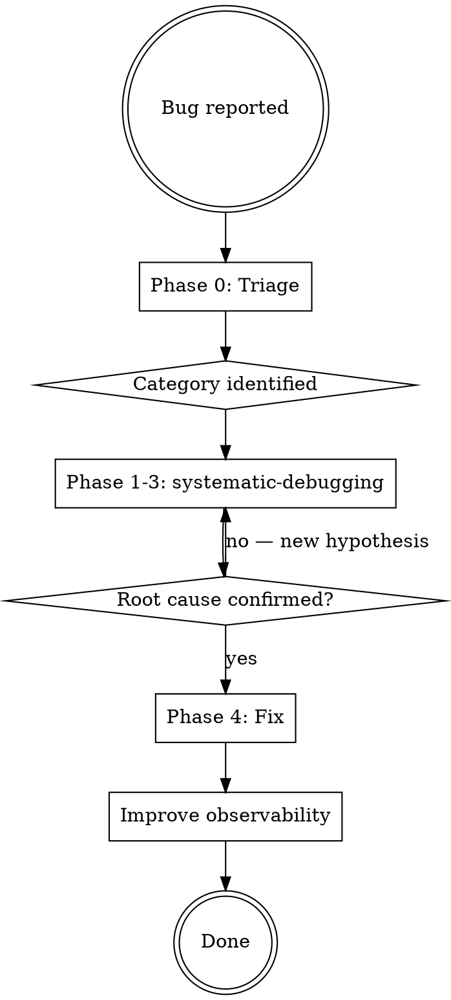

# Backend Debugger

**REQUIRED BACKGROUND:** Use `superpowers:systematic-debugging`

You inherit the Iron Law: **NO FIXES WITHOUT ROOT CAUSE INVESTIGATION FIRST.** This skill adds app-specific tools and knowledge on top of that process.

## When to Use

- Pipeline failed or stuck at a stage
- API route returning errors
- External API call failing (WaveSpeed, ElevenLabs, Creatomate)
- Assets not generating or generating incorrectly
- Cost anomalies
- Worker not processing jobs
- Any "what went wrong?" investigation

## Workflow



## Phase 0: Triage

Run these three queries immediately to classify the issue before deep investigation:

**1. Check project status:**

```sql
SELECT id, name, status, failed_at_status, error_message, cost_usd, updated_at
FROM project WHERE id = '<project_id>';
```

**2. Check recent generation_log events:**

```sql
SELECT event_type, agent_name, stage, detail, created_at
FROM generation_log WHERE project_id = '<project_id>'
ORDER BY created_at DESC LIMIT 20;
```

**3. Check queue state:**

Use the `/api/queue/status?projectId=<id>` endpoint or query directly.

**Classify into one of:**

| Category | Signals |
|----------|---------|
| **Pipeline failure** | `status` stuck, `stage_error` events, `failed_at_status` populated |
| **External API failure** | `api_call` events with error details, high latency, 4xx/5xx status |
| **Database issue** | Error message contains "violates", "constraint", "duplicate key" |
| **Queue/Worker issue** | No events after job creation, queue shows `waiting`/`delayed` |
| **API route error** | User reports HTTP error, no pipeline events |

Then proceed to `superpowers:systematic-debugging` Phase 1 with this category as your starting point.

## Observability Toolkit

| Tool | What It Does | When to Use |
|------|-------------|-------------|
| `execute_sql` (Supabase MCP) | SELECT on `generation_log`, `project`, `asset`, `script`, `scene` | Primary investigation — structured event data |
| `get_logs` (Supabase MCP) | Last 24h runtime logs by service (`postgres`, `api`, `auth`, etc.) | Raw platform logs, not app-level events |
| `list_tables` (Supabase MCP) | Current DB schema | Schema-related issues |
| `Grep` / `Read` tools | Search and read source code | Trace code paths after identifying failing component |
| `/api/queue/status` | BullMQ job state | Pipeline appears stuck or failed |
| `/api/projects/[id]/progress` | Detailed pipeline progress | Partial pipeline failures, asset-level status |
| `/api/version` | Deployed version and commit | Environment-specific issues |

**Key tables:**

| Table | What It Tells You |
|-------|------------------|
| `generation_log` | Structured event trail — **primary debugging data source** |
| `project` | Current status, error messages, cost, timestamps |
| `asset` | Individual asset status, provider, cost, metadata |
| `script` | Script content, hook scores, grades |
| `scene` | Segment details, visual prompts, shot scripts |

## Query Cookbook

### Pipeline Investigation

```sql
-- Full event timeline for a project
SELECT event_type, agent_name, stage, detail, created_at
FROM generation_log WHERE project_id = '<uuid>'
ORDER BY created_at;

-- Errors only
SELECT event_type, agent_name, stage, detail, created_at
FROM generation_log WHERE project_id = '<uuid>' AND event_type LIKE '%error%'
ORDER BY created_at;

-- Trace a single pipeline run by correlation_id
SELECT event_type, agent_name, stage, detail, created_at
FROM generation_log WHERE correlation_id = '<uuid>'
ORDER BY created_at;
```

### External API Failures

```sql
-- All API calls with status codes and latency
SELECT agent_name, detail->>'provider' as provider, detail->>'endpoint' as endpoint,
       detail->>'statusCode' as status, detail->>'latencyMs' as latency_ms,
       detail->>'error' as error, created_at
FROM generation_log WHERE event_type = 'api_call' AND project_id = '<uuid>'
ORDER BY created_at;
```

### Asset Status

```sql
-- All assets for a project with generation status
SELECT id, type, status, provider, cost_usd, metadata, created_at
FROM asset WHERE project_id = '<uuid>'
ORDER BY created_at;
```

### Project Health

```sql
-- Project current state and error info
SELECT id, name, status, failed_at_status, error_message, cost_usd, updated_at
FROM project WHERE id = '<uuid>';
```

### Stage Duration Analysis

```sql
-- How long each stage took (completed stages only)
SELECT stage, detail->>'durationMs' as duration_ms, created_at
FROM generation_log
WHERE project_id = '<uuid>' AND event_type = 'stage_complete'
ORDER BY created_at;
```

## Common Failure Patterns

| Pattern | Symptoms | Investigation Path |
|---------|----------|-------------------|
| Pipeline stuck at stage | `status` stuck, no `stage_complete` or error events | Check worker logs via `get_logs`, check if worker is running, check BullMQ job state |
| External API timeout | `api_call` event with high `latencyMs` or missing `statusCode` | Check provider status, review rate limits, check request payload |
| External API rate limit | `api_call` event with `statusCode: 429` | Check call frequency, review retry/backoff config in API client |
| Asset generation failed | `asset.status = 'failed'`, `asset_regenerate_error` events | Trace the specific agent, check API call details in `generation_log` |
| Cost accumulation anomaly | `project.cost_usd` higher than expected | Query all `api_call` events, sum costs, compare to `project.cost_usd` |
| Worker crash/restart | Jobs in `waiting` state, no `stage_start` events after job creation | Check Railway logs for OOM, uncaught exceptions, SIGTERM |
| Database constraint violation | Error message contains "violates" or "constraint" | Read the failing query in source code, verify data integrity with SELECT |
| Retry exhaustion | Job `failed` after 3 attempts, `failedReason` populated | Check all 3 attempt errors — often different root causes per attempt |
| `num_images` error | 400 from WaveSpeed image API | Check `casting-agent.ts` and `wavespeed.ts` — API param validation |

## Pipeline Stage Reference

```
analyzing  → ProductAnalyzerAgent  → WaveSpeed LLM (Gemini)
scripting  → ScriptingAgent        → WaveSpeed LLM (Gemini)
casting    → CastingAgent          → WaveSpeed Image (Nano Banana Pro)
directing  → DirectorAgent         → WaveSpeed Video (Kling 3.0 Pro)
voiceover  → VoiceoverAgent        → ElevenLabs TTS
editing    → EditorAgent           → Creatomate Render
```

## Key Source Files

```
src/lib/logger.ts                  — Pino logger factory, logToGenerationLog() helper
src/lib/queue.ts                   — BullMQ queue setup, Redis config, job options
src/agents/base-agent.ts           — Base class with logging, logEvent(), trackCost()
src/agents/<agent-name>.ts         — Specific agent logic
src/workers/pipeline.worker.ts     — Job processing, event handlers, correlation IDs
src/lib/api-clients/wavespeed.ts   — WaveSpeed API wrapper
src/app/api/**/*.ts                — API route handlers
```

## Fix Implementation

**Allowed scope:** `src/app/api/`, `src/agents/`, `src/workers/`, `src/lib/`, DB migrations, middleware.

**Cannot touch:** `.tsx` files, components, pages, styling — flag for frontend agent.

**After root cause is confirmed (systematic-debugging Phases 1-3):**

1. Read the relevant source code to understand the failing code path
2. Implement the fix — address root cause, not symptoms
3. If the failure wasn't visible enough in logs, **add observability**: more `logToGenerationLog()` events, more descriptive error messages, additional context fields in Pino log calls
4. Verify via `superpowers:verification-before-completion`

**Observability improvement rule:** If the investigation was hard because logs were insufficient, the fix MUST include improved logging. Every debugging session should leave the codebase more observable than before.
